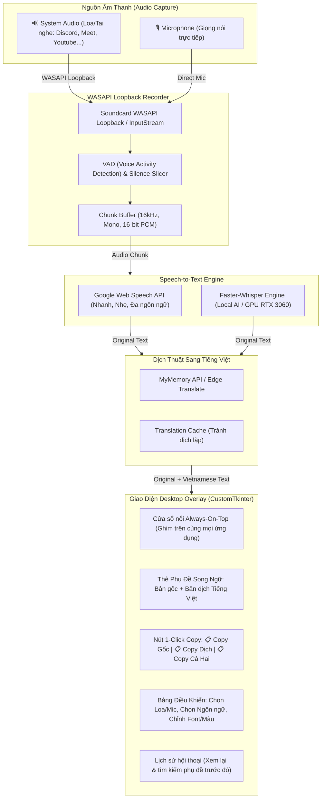

# Kiến Trúc Hệ Thống ToolListen (Realtime Audio Subtitle & Translator)

## 1. Sơ đồ Luồng Hoạt động (Data Flow & Architecture)

## 2. Chi tiết các thành phần chính
1. **Audio Capture Layer (`src/audio/recorder.py`)**:
   - Sử dụng Windows WASAPI Loopback để "nghe lén" chính xác mọi âm thanh đang phát ra tai nghe / loa của hệ thống (bất kể phát từ tab trình duyệt Youtube, ứng dụng Discord, Zoom hay Google Meet).
   - Tích hợp bộ lọc năng lượng âm thanh (RMS Energy threshold) và kiểm tra khoảng lặng (silence detection) để cắt câu thoại tự nhiên, không cắt vụn chữ.

2. **STT Transcriber Layer (`src/stt/transcriber.py`)**:
   - Hỗ trợ chọn ngôn ngữ nguồn: `en-US` (Tiếng Anh), `auto` (Tự động phát hiện), `ja-JP` (Tiếng Nhật), `zh-CN` (Tiếng Trung), `ko-KR` (Tiếng Hàn), `fr-FR` (Tiếng Pháp)...
   - Bộ giải mã giọng nói chuyển luồng PCM audio thành chuỗi văn bản.

3. **Translator Layer (`src/translator/service.py`)**:
   - Nhận chuỗi văn bản từ STT, dịch sang Tiếng Việt.
   - Cơ chế fallback thông minh: Thử dịch MyMemory -> Bing / Edge -> Cache.

4. **UI Layer (`src/ui/app.py`)**:
   - Cửa sổ nổi Always-on-Top với nền bán trong suốt / dark mode hiện đại.
   - Thao tác 1 click để Copy nhanh vào clipboard (có toast phản hồi "Đã copy!").
   - Lịch sử đầy đủ giúp người dùng không bỏ lỡ câu thoại khi đang họp hoặc xem video dài.
